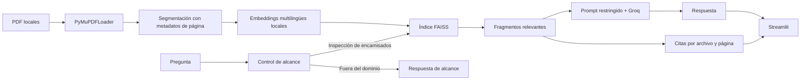

# Asistente en Protección Catódica

Agente inteligente RAG (Retrieval-Augmented Generation) para consultar
exclusivamente información sobre **inspección y diagnóstico de ductos
encamisados**. La aplicación responde con base en dos guías de estudio y la
norma NACE SP0200-2014 disponibles localmente, y muestra las páginas utilizadas
como fuentes.

> Este asistente es una ayuda de consulta documental. No sustituye un
> procedimiento aprobado, el análisis de ingeniería ni los requisitos
> regulatorios vigentes.

## Capacidades

- Lee y procesa automáticamente los PDF de `data/docs/`.
- Divide cada página en fragmentos y conserva archivo y número de página.
- Genera embeddings multilingües de forma local.
- Recupera los fragmentos más relevantes mediante FAISS.
- Responde con Groq y `llama-3.3-70b-versatile`.
- Cita el documento, página y fragmento usados en cada respuesta.
- Rechaza preguntas ajenas a la inspección de encamisados.
- Reconstruye el índice cuando cambia un PDF o la configuración de segmentación.
- Mantiene la clave de API fuera del código y del historial de Git.

## Fuentes documentales

La aplicación espera estos tres archivos en `data/docs/`:

1. `guia_corto_circuito_casings.pdf`
2. `Guia_estudio_pruebas_ducto_camisa_cortos_electroliticos.pdf`
3. `SP0200-2014-Steel-Cased-Pipeline-Practices.pdf`

Los PDF no se incluyen en el repositorio público. En particular,
SP0200-2014 contiene restricciones de distribución; cada usuario debe aportar
una copia obtenida y utilizada conforme a su licencia. Consulta
[`data/docs/README.md`](data/docs/README.md).

## Arquitectura



### Componentes

- `app.py`: interfaz de chat, historial y presentación de citas.
- `src/ingest.py`: lectura de PDF y segmentación.
- `src/vectorstore.py`: embeddings, índice FAISS y huella de las fuentes.
- `src/chain.py`: control de alcance, prompt, llamada a Groq y respuesta.
- `src/helper.py`: configuración mediante variables de entorno.
- `tests/test_agent.py`: pruebas de alcance, citas, ingesta y comportamiento.

El índice se almacena en `data/faiss_index/` solo en la máquina local. Un
manifiesto registra el hash de los PDF, el modelo de embeddings y el tamaño de
los fragmentos. Si alguno cambia, el índice se vuelve a crear automáticamente.

## Tecnologías

- Python 3.10 o superior
- Streamlit
- LangChain
- Groq (`langchain-groq`)
- PyMuPDF
- Sentence Transformers
- FAISS
- Pytest

## Ejecución local

### 1. Clonar y crear el entorno

En PowerShell:

```powershell
git clone git@github.com:FerIqm1993/alura_challenge_agente.git
cd alura_challenge_agente
py -m venv .venv
.\.venv\Scripts\Activate.ps1
python -m pip install -r requirements.txt
```

En Linux o macOS:

```bash
git clone git@github.com:FerIqm1993/alura_challenge_agente.git
cd alura_challenge_agente
python3 -m venv .venv
source .venv/bin/activate
python -m pip install -r requirements.txt
```

### 2. Agregar las fuentes

Copia los tres PDF autorizados a `data/docs/` respetando exactamente los
nombres indicados en la sección de fuentes.

### 3. Configurar Groq

```powershell
Copy-Item .env.example .env
```

Edita `.env`:

```dotenv
GROQ_API_KEY=tu_clave_de_groq
GROQ_MODEL=llama-3.3-70b-versatile
```

`GROQ_API_KEY` es el nombre oficial. Por compatibilidad, el código también
reconoce `GROP_API_KEY`, pero se recomienda corregir el nombre.

### 4. Iniciar la aplicación

```powershell
streamlit run app.py
```

Abre `http://localhost:8501`. Durante el primer inicio se descargará el modelo
local de embeddings y se construirá el índice; los siguientes inicios cargarán
el índice existente si la huella sigue vigente.

## Preguntas de ejemplo

- ¿Cómo se distingue un corto metálico de un corto electrolítico en una camisa?
- ¿Qué mediciones deben registrarse durante una prueba ducto-camisa?
- ¿Dónde debe colocarse el electrodo de referencia en una prueba de encamisado?
- ¿Qué respuesta de potencial indica que una camisa está eléctricamente aislada?
- ¿Qué errores deben evitarse al comparar potenciales ducto/suelo y camisa/suelo?
- ¿Qué pasos recomienda SP0200-2014 para evaluar una camisa en corto?

Una pregunta fuera del dominio, como “¿Cómo dimensiono una cama anódica?”, se
rechaza porque no menciona ni requiere inspección de encamisados.

## Ejemplos de respuestas

**Pregunta:** ¿Cómo se distingue un corto metálico de uno electrolítico en una
camisa?

**Respuesta de ejemplo:** Un corto metálico probable presenta una resistencia
muy baja y los potenciales del ducto y la camisa tienden a permanecer casi
iguales aun cuando se aplica corriente. En un acoplamiento electrolítico hay una
trayectoria conductiva por electrolito: los potenciales están relacionados, pero
la respuesta de la camisa suele ser atenuada y no se igualan por completo. Una
resistencia baja por sí sola no demuestra contacto metal-metal; deben integrarse
potenciales, resistencia y respuesta a la corriente aplicada.

La interfaz acompaña la respuesta con las páginas recuperadas de las guías.

**Pregunta:** ¿Dónde se coloca el electrodo de referencia en una prueba de
encamisado?

**Respuesta de ejemplo:** SP0200-2014 indica posicionarlo sobre el ducto
portador, cerca del extremo de la camisa, y no directamente sobre la camisa.
Durante comparaciones sucesivas debe mantenerse una ubicación controlada.

La interfaz cita la página correspondiente de SP0200-2014 y, cuando procede, la
guía de estudio.

## Pruebas

```powershell
python -m pytest -q
python -m compileall -q app.py src tests
```

Las pruebas no consumen la API de Groq. Cubren:

- preguntas dentro y fuera del alcance;
- bloqueo previo a la recuperación y al LLM;
- citas sin duplicados y numeración de páginas;
- lectura real de los tres PDF;
- invalidación del índice cuando cambia una fuente;
- armado de una respuesta sustentada mediante dobles de prueba.

## Seguridad y buenas prácticas

- Nunca escribas una clave real en `.env.example`, README, código o commits.
- `.env`, los PDF, el índice FAISS y archivos temporales están ignorados por Git.
- Si una clave fue compartida en texto plano, revócala y genera otra antes de
  usar el proyecto o publicarlo.
- Revisa las respuestas y las páginas citadas antes de tomar decisiones de campo.

## Limitaciones

- La calidad depende del contenido y legibilidad de los PDF.
- La recuperación semántica no equivale a una verificación de ingeniería.
- El control de alcance es deliberadamente conservador: una pregunta ambigua
  debe mencionar la camisa, el encamisado o una prueba ducto-camisa.
- La norma incluida puede no ser la edición vigente; corresponde al usuario
  verificar aplicabilidad, revisión y requisitos regulatorios.

## Licencia del código

Elige y agrega una licencia para el código antes de la publicación. Las
licencias de los documentos fuente son independientes y no quedan transferidas
por este proyecto.
